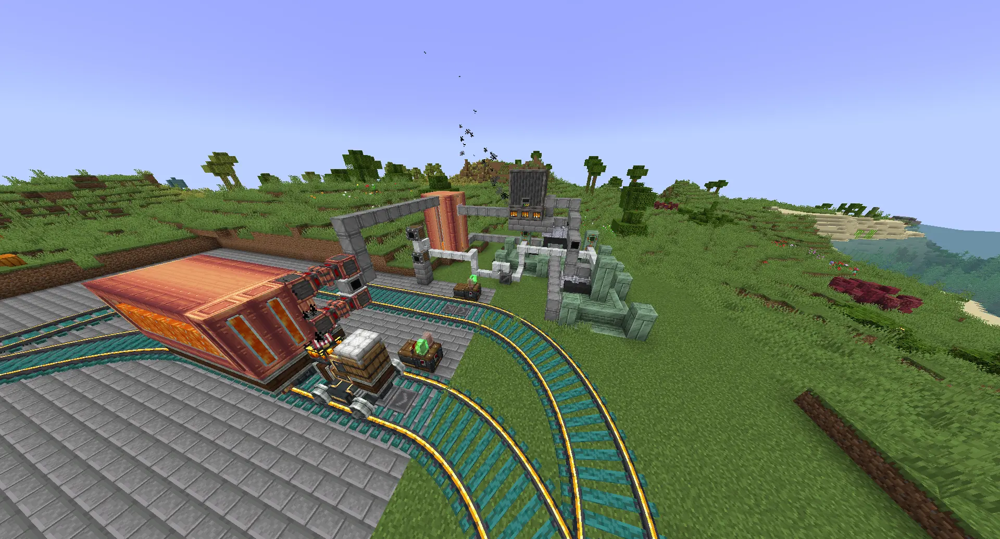

.. _ore-automation:

Ore Automation
==============

As your factory grows larger, mining ores by hand from the world becomes significantly less 
feasible; large multiblocks require a large amount of metals to build the individual casings
and even individual machines require eight of their tier's ingots to build.

World Eaters
------------

In a technical sense, these are an option. Create drills attached to a rope pulley or piston and
placed above or alongside ore chunks can gather hundreds of ores in a single go. Nevertheless, 
these are *very* slow, require moving manually after eating a chunk, produce lots of waste, and
leave gigantic holes in your world. 

You can also use the GTCEu miners; these mine a smaller area much faster, but still require ore
chunks in the overworld and a significant amount of actual EU power.

Orestone Synthesis
------------------

The first option available for mass automation of ores is from the Create-based orestones. In the
base Create mod these can be crushed to get crushed ores and nuggets, but BI expands them to produce
crushed GTCEu ores at a much higher percentage. 

To buff up your mining in the early game you can simply mine the large veins in the overworld and 
crush them in Create Millstones or Crushing Wheels, then smelt the resultant ores. Orestone veins
are usually a bit denser than GTCEu ore veins, but come at a cost of only having a chance
of outputting ores.

.. _molten-vents-auto:

Orestone Automation
~~~~~~~~~~~~~~~~~~~

You can automate the synthesis of orestones themselves by finding a **Molten Vent** in the 
overworld. These are tall pillars of orestone blocks that exit at the surface, containing a central
tube of lava capped off by a *dormant vent block*. Using an explosive on the dormant block turns
it into an *active vent block* that can produce ores.

.. note::

    Dormant vents can be moved using Create contraptions. The vents have a bad habit of spawning
    right on the corners of a chunk making it difficult or impossible to build a rock synthesiser
    on top without crossing a chunk border. This also makes it easier to build an outpost when
    there are multiple vents clustered together without needing to load a lot of chunks.

.. warning::

    Active vents *cannot* be moved, and neither the dormant or the active vent block will drop 
    anything when mined. If you break a vent, you cannot get it back.

Once a vent block is active, you can place down lava on it which will be cooled and frozen instantly
into the respective orestone block. With six available faces to place, this means you can create six
blocks at once and then break them with a drill.

Rock Synthesis
~~~~~~~~~~~~~~

    An orestone outpost with three rock synthesisers.

The better way to create orestones is with the Rock Synthesiser (and the Hyperscalar Rock Forge).
These multiblock machines incorporate the molten vent directly into their frames, and can produce 
any type of orestone from any type of vent. One rock synthesiser can produce 288 orestones every
72 seconds (or, 4 orestones a second) in exchange for a hundred buckets of lava (or about 1.338 
buckets a second). 

As you already have to ship in lava for the rock synthesisers themselves, the best way to power
them is by using `large boilers <gen-steam-power>`_. A large bronze boiler can power two rock 
synthesisers, and a large steel boiler can power four.

.. warning::

    The base Rock Synthesiser **cannot** overclock. They will always run at Medium Voltage, and
    adding higher tier energy hatches will *not* improve their speed.

    The only way to get more orestones before the Rock Forge is to build more Rock Synthesisers.

Obtainable Ores
~~~~~~~~~~~~~~~

This is a table of the obtainable ores from orestones. The chances refer to the chance of producing
that specific ore in a Create crusher; as well as the average percentage (+/- 10%) out of a full
stack of crushed ore you would get in the Ball Bearing Grinding Mill.

+----------+--------------+--------------+---------------+
| Orestone | 70% Chance   | 40% Chance   | Nugget        |
+==========+==============+==============+===============+
| Asurine  | Cassiterite  | Garnierite   | Tin           |
+----------+--------------+--------------+---------------+
| Crimsite | Redstone     | Sphalerite   | Redstone Dust |
+----------+--------------+--------------+---------------+
| Ochrum   | Hematite     | Hematite     | Iron          |
+----------+--------------+--------------+---------------+
| Scorchia | Galena       | Arsenopyrite | Silver        |
+----------+--------------+--------------+---------------+
| Scoria   | Bauxite      | Silver       | Silver        |
+----------+--------------+--------------+---------------+
| Veridium | Tetrahedrite | Chromite     | Copper        |
+----------+--------------+--------------+---------------+

