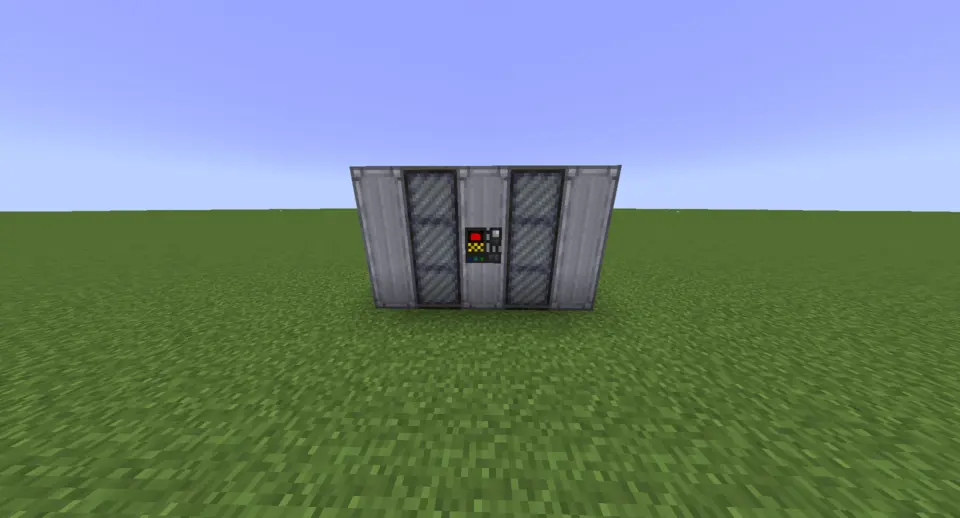
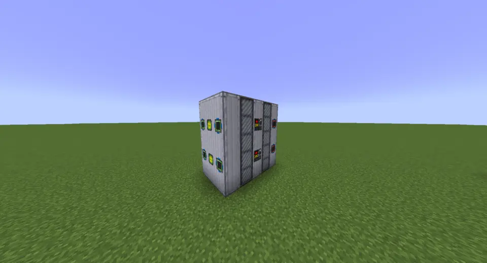

.. _multiblock-cracker:

Cracker
=======

    The humble cracker.

+---------------+---------------+---------------+------------+
| Hatch Type    | Minimum Count | Maximum Count | Placement  |
+===============+===============+===============+============+
| Energy Input  | 1             | 2             | Any casing |
+---------------+---------------+---------------+------------+
| Energy Output | N/A           | N/A           | N/A        |
+---------------+---------------+---------------+------------+
| Fluid Input   | 1             | Unlimited     | Any casing |
+---------------+---------------+---------------+------------+
| Fluid Output  | 1             | Unlimited     | Any casing |
+---------------+---------------+---------------+------------+
| Item Input    | N/A           | N/A           | N/A        |
+---------------+---------------+---------------+------------+
| Item Output   | N/A           | N/A           | N/A        |
+---------------+---------------+---------------+------------+
| Muffler       | 1             | 1             | Any casing |
+---------------+---------------+---------------+------------+

The Cracker is a multiblock designed for the cracking of long-chain hydrocarbons into smaller
hydrocarbons, either using steam or hydrogen.

Behaviour
---------

The Cracker takes in the fluid to be cracked in one hatch, and steam or hydrogen in the other
hatch, and produces the cracked fluid output that can be piped to a distillery or a distillation
tower. The Cracker always requires a circuit, which can be set in the virtual circuit slot of one
of the input hatches. This circuit controls if the output fluid is lightly or severely cracked.

The Cracker uses coil blocks; every coil tier above Cupronickel uses 10% less energy. As you need
ferrochroluminium coils to make the ferrochrome required for the casings, you should always start
with ferrochroluminium coils to save a small amount of energy.

The Cracker also requires a muffler hatch; this hatch can be anywhere on the body of the cracker.

Sharing Pattern
---------------

    An example of tiling two Crackers on top of each other.

Due to the space available on the middle (unshared) row of a Cracker multiblock, it can be 
infinitely stacked vertically. Each one should have its own energy hatch and output hatch, but
the two input hatches can be shared between groups of two Crackers.
