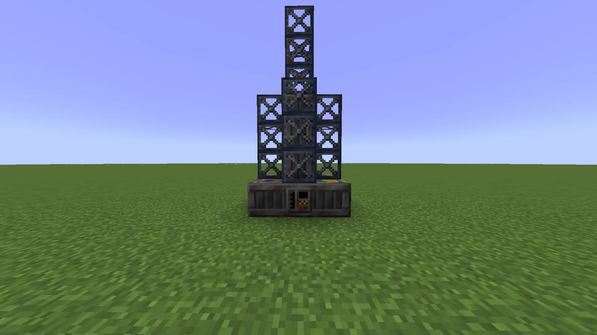
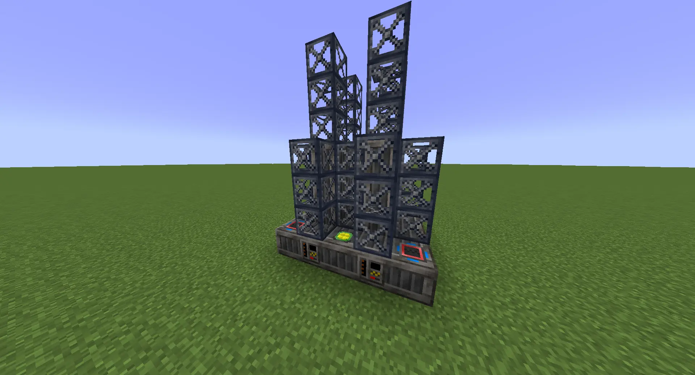

.. _multiblock-drilling-rig:

Advanced Fluid Drilling Rig
===========================

    A single Advanced Fluid Drilling Rig I.

+---------------+---------------+---------------+--------------+
| Hatch Type    | Minimum Count | Maximum Count | Placement    |
+===============+===============+===============+==============+
| Energy Input  | 1             | 2             | Bottom layer |
+---------------+---------------+---------------+--------------+
| Energy Output | N/A           | N/A           | N/A          |
+---------------+---------------+---------------+--------------+
| Fluid Input   | N/A           | N/A           | N/A          |
+---------------+---------------+---------------+--------------+
| Fluid Output  | 0             | 1             | Bottom layer |
+---------------+---------------+---------------+--------------+
| Item Input    | N/A           | N/A           | N/A          |
+---------------+---------------+---------------+--------------+
| Item Output   | N/A           | N/A           | N/A          |
+---------------+---------------+---------------+--------------+

The Advanced Fluid Drilling Rig is a special multiblock that drills out fluid veins from underneath
bedrock. 

Behaviour
---------

When powered, an Advanced Fluid Drilling Rig will produce an infinite amount of a certain fluid
depending on the chunk it is found in. The fluid for a chunk can be found by using the prospector
in Fluid Prospection mode (shift + right click whilst holding it).

.. note::

    The default prospector view makes it difficult to differentiate the oils. Switch to Dark Mode
    and select the oil type in the right that you wish to check; it will be a slightly different
    colour.

Fluids in a chunk will slowly be depleted over time as drills in extract it. The more depleted a 
chunk is, the less fluid will be extracted per second until the drill reaches a baseline level 
called the *depleted level*. This is the minimum possible output per second for a drill. Once
fully depleted, all drills in that chunk will produce that amount of fluid, forever.

Tiered Behaviour
~~~~~~~~~~~~~~~~

The Advanced Fluid Drilling Rig has three tiers:

- The first tier uses regular steel, and accepts either MV or HV energy. It fully depletes veins
  and only produces either 1x (MV) or 1.5x (HV) the amount of fluid available in a chunk.

- The second tier uses titanium, and accepts either HV or EV energy. It only depletes veins halfway
  but produces 16x (HV) or 24x (EV) the amount of fluid available in a chunk.

- The third and final tier uses tungstensteel and accepts either EV or IV energy. It only depletes
  veins to 12.5%, and produces a whopping 64x (EV) or 96x (IV) the amount of fluid available in
  a chunk.

.. warning::

    With the buffs to fluid veins, the third tier of drills may be removed in the future.

Overclock Behaviour
~~~~~~~~~~~~~~~~~~~

The Advanced Fluid Drilling Rig has a unique overclock behaviour. No matter what energy hatches
are used, it will always take exactly one second to produce its fluid. Instead, the overclock will
cause the amount of fluid produced per cycle to change; overclocking the first tier of drill to
HV will output 1.5x the amount of fluid it normally would at MV.

.. warning::

    Hatches beyond the maximum overclock of the drilling rig are useless. Don't waste your 
    resources.

Sharing Pattern
---------------

    A 2x2 block of drilling rigs, with two energy hatches and four output hatches.

Advanced Fluid Drilling Rigs are good candidates for wall sharing due to their square symmetric 
shape and only needing to use two multiblock parts. A 2x2 block is the most efficient method for
sharing; they can't be tiled due to having a maximum of one output hatch per drill.
