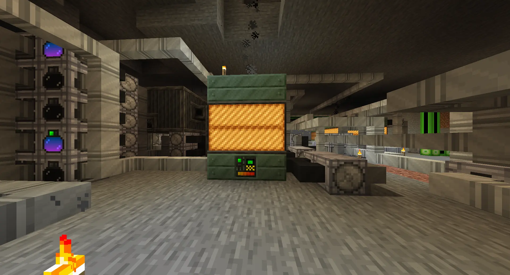
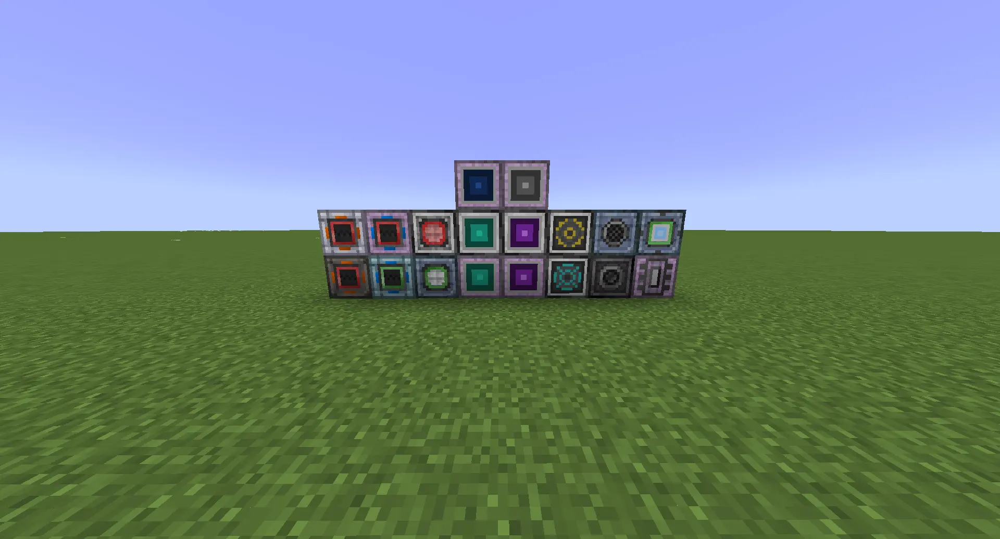
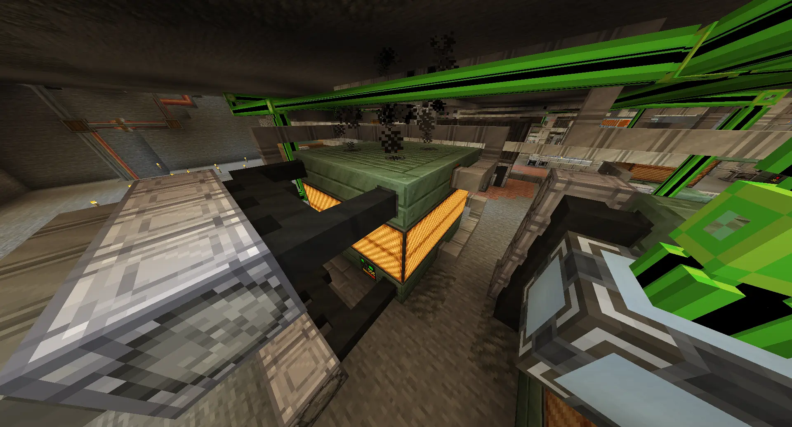

.. _modular-multiblocks: 

Modular Multiblocks
===================

    A single Electric Blast Furnace, the most well-known of the modular multiblocks.

GTCEu adds two types of machines: singleblock machines, which (as the name suggests) take up a 
singular block in the world; and multiblock machines, which take up the space of multiple blocks
in the world.

Multiblock machines are built in a specific shape; for example, the Electric Blast Furnace is made
of a layer of invar casings at the bottom, two layers of coils in the middle, and another layer of
casings at the top. For a lot of multiblock machines - including the EBF - some of these casings
can be replaced with *multiblock parts* which the multiblock machine uses to input or output
resources such as items or energy.

These parts can be placed anywhere within the casing portions of a multiblock machine, allowing for 
flexibility with the logistics of loading and unloading resources. Not all machines take all parts; 
some machines only process fluids and as such do not use item buses (and vice-versa).

Most multiblocks have a minimum and maximum on the number of parts of a specific type; this is
shown in every multiblock documentation page as well as the in-game multiblock viewer.

Multiblock Preview
------------------

Using the "Usage" button on a multiblock controller (by default, the U key, or right clicking in 
the item index) will show a "Multiblock Info" tab for a specific multiblock. This shows you the
shape of the multiblock, as well as a list of available parts for that multiblock. Each part in the
row at the bottom of the window has a tooltip that may list the minimum and maximum number of parts
of a specific type per multiblock.

.. note::

    The part list shows the tier that the multiblock's preview was registered with, but it is very
    rare that you would have to use that specific tier of parts for a multiblock. 

    For example, the Electric Blast Furnace shows 2 LV Energy Hatches by default, but a single
    MV Energy Hatch will also work. Fulfilling the shape of the multiblock and the required parts
    for your desired recipe are the most important part of building the multiblock.

If you click on a block in the preview, it will show you what parts you can place in that position.
Some positions may only let you place a specific type of part, or no parts at all. On the right
side of the tab, clicking the "ALL" button will let you see how the multiblock is built, layer by
layer, from bottom to top. The button above it may also show different variants of the multiblock,
if any.

.. note::

    For the vast majority of multiblocks, empty blocks in the shape/preview have a specific meaning
    depending on where they are inside the shape.

    For empty blocks on the outside, you can usually place *any* block there, such as pipes or 
    cables. For empty blocks on the *inside*, that nearly always means you **must** leave air there
    instead. 

    For a good example, see the Bessemer Converter; the inside must be filled with air, but the
    outside (underneath where the middle ridge hangs) can have pipes placed inside.

    A rainbow array of the various hatches.

Item & Fluid I/O
----------------

The parts for item I/O are Buses, and the parts for fluid I/O are hatches. Like most machines,
these hatches follow the GTCEu voltage tiers, from ULV to MAX. Every bus has :math:`tier^2` slots
available, and every hatch has :math:`16 * tier` buckets of fluid storage available.

All hatches are searched through when matching a recipe. For example, if a recipe requires 30 
buckets of a fluid, but you only have LV hatches, you can use *two* LV hatches and fill them up
to a collective 30 buckets. 

From the EV tier onwards, you can make *quadruple* and *nonuple* input and output hatches. These
sacrifice the total capacity to add multiple slots for fluids. A regular EV hatch has 128 buckets 
of fluid storage; a quadruple hatch has 32 buckets for four different fluids, and a nonuple 
hatch has 16 buckets for nine different fluids. 

From the LuV tier onwards, you can build dual hatches. These combine an item bus and a fluid bus
into a single block, at the cost of losing a certain amount of storage per block.

Energy I/O
----------

All non-generator multiblocks require energy to run. Energy is provided to a multiblock with the
usage of *energy hatches*, which all take in up to 2 amps of energy of their voltage tier for the
usage of all attached multiblocks. Generators use *dynamo hatches*, which provide up to 2 amps of
energy from a multiblock.

From the EV tier onwards, you can build 4A and 16A energy hatches and dynamo hatches. These take or 
produce up to 4A or 16A of energy of their voltage tier, respectively.

Energy hatches consuming 2A of output means that multiblocks can be easily overclocked one tier
by placing down two regular energy hatches, one tier by placing down one 4A energy hatch, and two
full tiers by placing down one 16A energy hatch.

Miscellaneous Parts
-------------------

There are some additional multiblock parts that don't fall into any of these categories.

- Muffler hatches are used on boilers, multiblock generators, the EBF, the Bessemer Converter, 
  the Pyrolyse Oven, and the Cracker. They produce a smoke particle effect as well as a small
  amount of ashes that need to be manually removed. They cannot be blocked by other blocks or the
  machine will fail to function.

  Muffler hatches *do not* block recipes if they are full.

- The Parallel Control Hatch is used on some lategame multiblocks to run multiple recipes at the
  same time. 

- If you have AE2 installed, the ME Input/Output Hatch/Bus works as an ME network connected version
  of the regular hatches. These are available at the EV tier and above.

- Laser Hatches are used for the active transformer, a late-game energy transmission multiblock.

- Coils are used for the Cracker, Electric Blast Furnace, Pyrolyse Oven, and Alloy Blast Furnace. 

Multiblock Wallsharing
----------------------

    A 2x2 block of Electric Blast Furnaces.

Multiblocks are expensive to build, usually requiring stacks of ingots per machine and even more
for the supporting logistics. Some of this cost can be avoided with the use of wall sharing.

The outmost wall of a multiblock can overlap with the outmost wall of another one; provided the
controller remains on an outside wall, you can tile multiblocks together as long as you have enough
available part slots available. 

Multiblocks can *share parts*, which makes multiple multiblocks act as if they both had that part; 
for example, if two multiblocks share an input bus, they will both take items from that input bus 
as if each one had a unique copy. The same is true of output buses or hatches. In order to share
a multiblock part, it must be located on the shared wall of multiple multiblocks.

Some multiblocks have a part limit, which effectively limits how they can be shared. For square 
and symmetrical multiblocks, tiling them in 2x2 squares is usually the most efficient way of 
wall sharing.

.. note::

    For overclocking multiblocks using regular energy hatches, both multiblocks should have their
    own hatches instead of using two shared ones; otherwise, one will get all 4 amps of energy and
    the other one will get none of it.

    This is not a problem if both multiblocks are sharing two 4A hatches.

.. danger::

    Multiblock outputs should **not** be shared. If one multiblock fills up an output bus/hatch,
    when the second one tries to output all of the outputs will be voided.

    See `this upstream bug <https://github.com/GregTechCEu/GregTech-Modern/issues/1628>`__.
